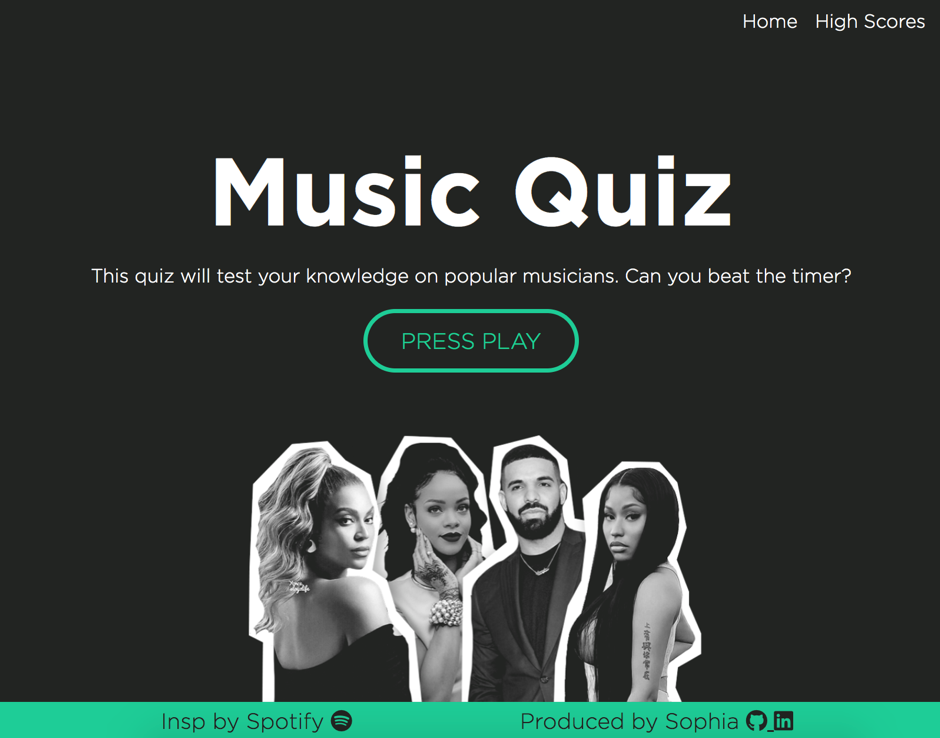
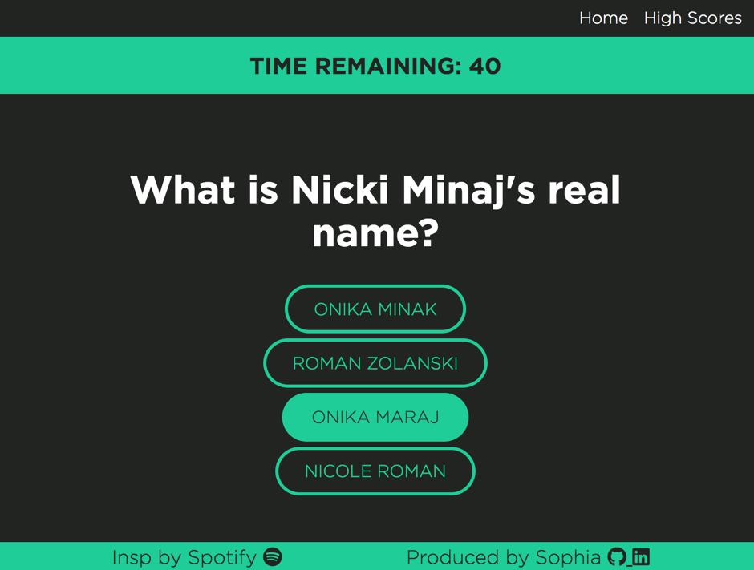
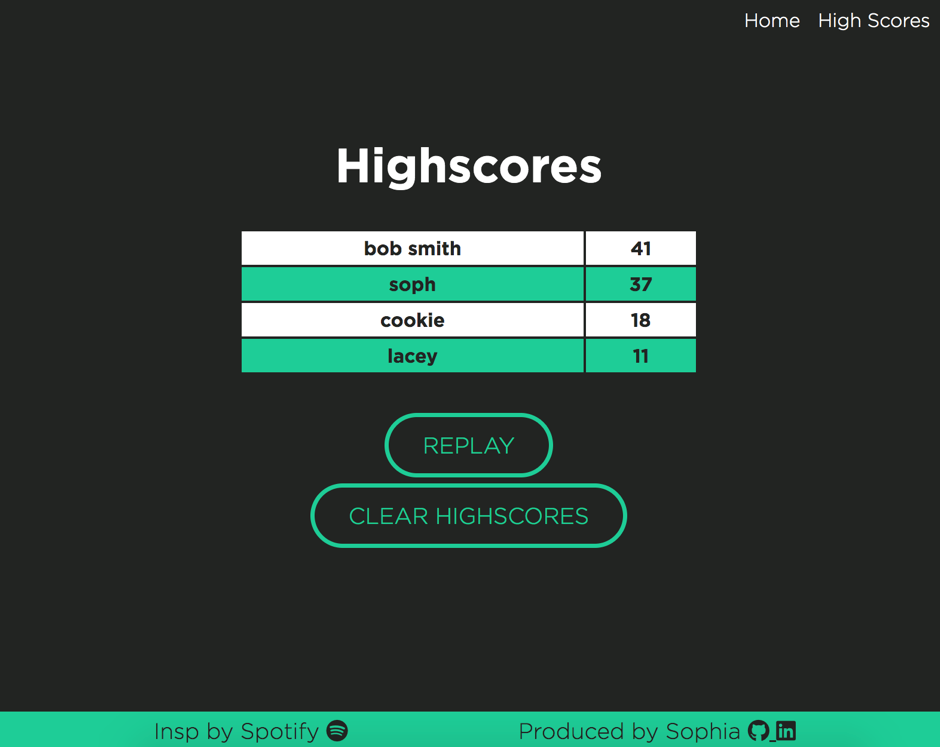
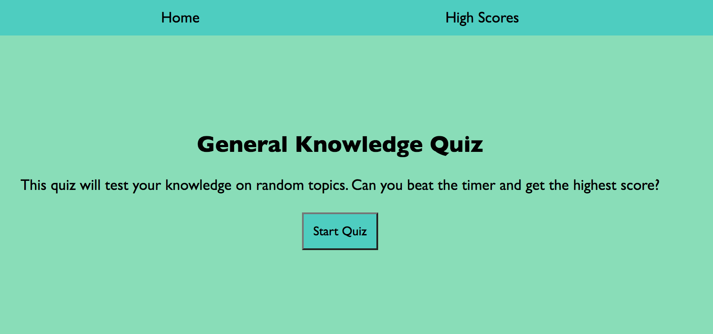
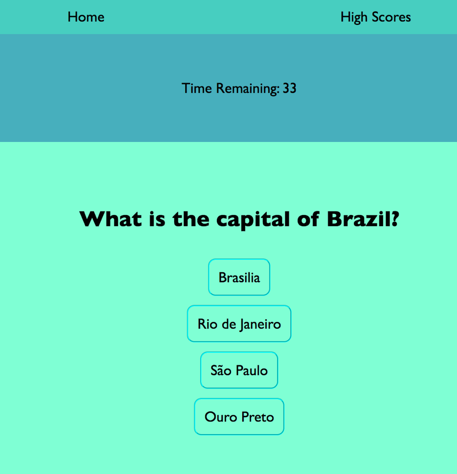
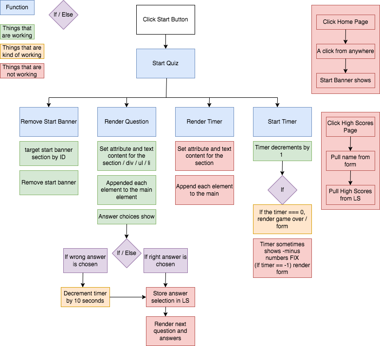
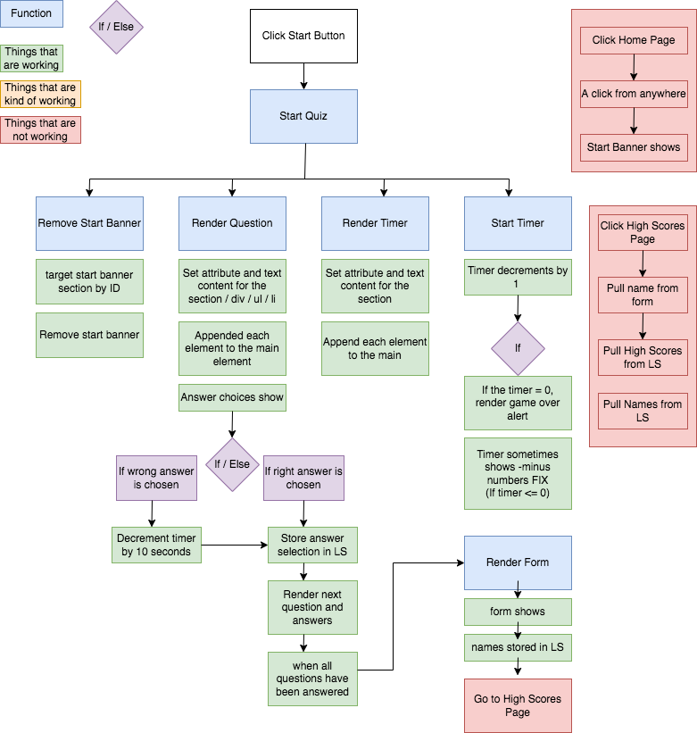

# Coding Quiz

This challenge was to create an interactive, timed quiz using HTML, CSS and JavaScript.

Click here to see the deployed page: https://sophia4422.github.io/coding-quiz/

# Quiz Theme

The styling of the quiz is inspired by Spotify. I have used their housestyle colours and I have incorporated a similar font to the one they use.

# How to Play

The aim of the quiz is to answer the questions correctly in as little time as possible.
You are given 10 seconds for every question. However, if you answer a question incorrectly, 10 seconds is deducted from the timer.
The time remaining on the clock when you complete the quiz becomes your score. Therefore, the more time remaining = a high score.

Your scores are saved into local storage and can be viewed on the 'Highscores' page. Clearing the highscores will clear your local storage.

<b>Expand to read about how my quiz used to look (when I only had 4 weeks coding experience)</b>

 

# User Journey

1. The page loads to show the nav bar, the quiz title, a description and a start button
2. When the Start Button is clicked
3. The Timer starts to count down from 40 seconds (10 seconds for each of the 4 questions)
4. Simultaneously, the first question appears with 4 answer choices

5. Click an answer choice
6. If the selected answer is correct: the next question displays
7. If the selected answer is wrong: 10 seconds from the timer is deducted, simultaneously the next question displays

Meanwhile:

- The timer is going down
- The current question you are on is being tracked

Game Over:

- When all questions are answered
- When remaining time reaches 0
- Then the form is rendered

Form:

- Please enter full name:
- Your Score is \*\*\* (the score is equal to the time remaining)
- Click Submit
- Score is stored in local storage

# Quiz Theme

When the homework was first presented, I wanted to make the quiz about music. I had an idea of doing a black/green Spotify inspired design. The questions would involve, finish the lyric, guess the album cover, name that song etc. However, for the purposes of time constraints I thought it would be in my best interest to neglect the css and focus more on the functionality of Javascript.

I did not want my quiz to focus solely on code related questions. I decided instead to do a random, general knowledge quiz, with coding included. I started with four basic questions:

**Question 1: What is the capital of Brazil?**
  Answers: Brasilia, Rio de Janeiro, São Paulo, Ouro Preto

Answer to Question 1

 
Brasilia

**Question 2: What does HTML stand for?**
  Answers: HyperText Market Linkup, HyperText Markup Language, Homepage Text Modem Language, How The Market Looks

Answer to Question 2

 
HyperText Markup Language

**Question 3: What colours make up the Jamaican flag?**
  Answers: Yellow, Black & Green / Red, Yellow & Green / Black, Red & Yellow / Black, Red & Green

Answer to Question 3

 
Yellow, Black & Green

**Question 4: What is Bruno Mars' real name?**
  Answers: Bruno L. Marshall, Bruno Jupiter, Michael Perez, Peter Gene Hernandez

Answer to Question 4

 
Peter Gene Hernandez

# Quiz Features

- Navigation Bar
  The nav bar will remain at the top of the page consistently
    The nav bar will feature two buttons:
- Home - this will always return the user to the homepage.
- High Scores - all scores inputted with a form will be loaded from local storage with the username and displayed highest to lowest.

- A timer: 40 seconds total, 10 seconds per question
- 4 multiple choice questions
- Form to add your name and save your highscore once the quiz has finished

# Meeting the Brief

The page loads to show a nav bar with a home button and a high scores button. A title, description and start button show. The page is mobile responsive. Unfortunately, the appearance of the quiz is not how I would have liked it to look. I did not put much time into the css in order to make time for the JavaScript.

When the Start Quiz button is clicked, the first question loads and the timer begins. The timer starts at 40 seconds (10 seconds per question) and counts down. When incorrect answers are selected, my timer decreases by 10 seconds. If the correct answer is selected, the timer stays the same.

I then hit a large roadblock during this homework and I was struggling to fix certain aspects.

I created this flow chart below to map out what areas were working and not working:

Below is my final flow chart to show the completed parts and areas of improvement:

